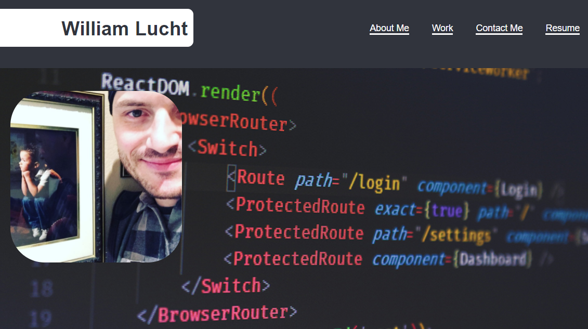

    
    
    
    
    
    

  

    
    
    

# React Portfolio

## Description

This project was a complete rebuild of an existing portfolio application using React.js!

Live URL: https://d606n6k.github.io/react-portfolio/

## Table of Contents

- [Usage](#usage)
- [Credits](#credits)
- [License](#license)

## Usage

- Navigate to https://d606n6k.github.io/react-portfolio/ to view my personal React portfolio!

## License

License: MIT

## Built With Node.js And These Node Packages

- [React.js](https://reactjs.org/)
- [Node.js](https://nodejs.org/en/)
- [npmjs](https://docs.npmjs.com/)
- [Heroku](https://heroku.com)

## How to Contribute

If you would like to contribute to this project, please fork the project as needed.

## Questions

Have any questions for the author? Contact this author via [Email](mailto:aaronlucht@gmail.com)

Check out the author's [Github](https://github.com/d606n6k)

## Credits

Created by [d606n6k](https://github.com/d606n6k)
